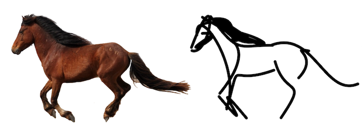

# Breathing Life Into Sketches Using Text-to-Video Priors
<a href="https://livesketch.github.io/"></a>
<a href="https://arxiv.org/abs/2311.13608"></a>
<a href="https://www.apache.org/licenses/LICENSE-2.0.txt"></a>
<!-- Official implementation. -->
<br>
<p align="center">
  
  
> <a href="https://livesketch.github.io/">**Breathing Life Into Sketches Using Text-to-Video Priors**</a>
>
<a href="https://rinongal.github.io/">Rinon Gal</a>,
<a href="https://yael-vinker.github.io/website/">Yael Vinker</a>,
<a href="https://yuval-alaluf.github.io/">Yuval Alaluf</a>,
<a href="https://www.cs.tau.ac.il/~amberman/">Amit Bermano</a>,
<a href="https://danielcohenor.com/">Daniel Cohen-Or</a>,
<a href="https://faculty.runi.ac.il/arik/site/index.asp">Ariel Shamir</a>
<a href="https://chechiklab.biu.ac.il/~gal/">Gal Chechik</a>
> <br>
>  Given a still sketch in vector format and a text prompt describing a desired action, our method automatically animates the drawing with respect to the prompt
</p>

# Setup
```
git clone https://github.com/yael-vinker/live_sketch.git
cd live_sketch
```

## Environment
To set up our environment, please run:
```
conda env create -f environment.yml
```
Next, you need to install diffvg:
```bash
git clone https://github.com/BachiLi/diffvg.git
cd diffvg
git submodule update --init --recursive
python setup.py install
```

# Input Sketch :writing_hand:
The input sketches should be provided in SVG format, and follow the recommended settings as described in the paper.<br>
You can generate your sketches with automatic tools or manually, as long as they follow the required format and can be processed with [diffvg](https://github.com/BachiLi/diffvg). <br>
Most of our sketches were generated using [CLIPasso](https://clipasso.github.io/clipasso/), which is an image-to-sketch method that produces sketches in vector format.
<p align="left">
 </p>

If you don't have your sketch already, you can generate a sketch using CLIPasso, by providing it an image, or even using existing [text-to-image](https://huggingface.co/stabilityai/stable-diffusion-xl-base-1.0) tools to generate an image, and then feed it to CLIPasso.<br><br>
To better adjust the input sketch to our reccomended settings, we provide a preprocessing script. To use it run:
```bash
python preprocess_sketch.py --target <path_to_SVG>
```
Your new sketch will be saved to "svg_input/\<filename\>_scaled".<br>
Please make sure to open this file locally to verify you are satisfied with the changes.

**Recommended sketch format:**
* Rendering size: 256x256
* Number of strokes: 16
* Strokes type: cubic Bezier curves
* Stroke width: 1.5

**Other Sketch Resources**<br>
Alternative tools for automatic sketch generation: [CLIPascene](https://clipascene.github.io/CLIPascene/), [DiffSketcher](https://github.com/ximinng/DiffSketcher), [VectorFusion](https://ajayj.com/vectorfusion/).<br>
Sketches from sketch Datasets: [TU-Berlin](https://cybertron.cg.tu-berlin.de/eitz/projects/classifysketch/), [Creative Sketch](https://github.com/facebookresearch/DoodlerGAN), [Rough Sketch Benchmark](https://cragl.cs.gmu.edu/sketchbench/)

**Example Sketches and Videos**<br>
We have provided many example sketches in SVG format under "svg_input/".

# Generate a Video! :woman_artist: :art:
To animate your sketch, run the following command:
```
CUDA_VISIBLE_DEVICES=0 python animate_svg.py \
        --target "svg_input/<SVG_file_name>" \
        --caption <your_caption> \
        --output_folder <output_folder_name> \
```
For example:
```
CUDA_VISIBLE_DEVICES=0 python animate_svg.py \
        --target "svg_input/surfer0_scaled1" \
        --caption "A surfer riding and maneuvering on waves on a surfboard." \
        --output_folder surfer0_scaled1 \
```
The output video will be saved to "output_videos/<output_folder_name>". <br>
The output includes the network's weights, SVG frame logs and their rendered .mp4 files (under svg_logs and mp4_logs respectively). At the end of training, we also output a high quality gif render of the last iteration (HG_gif.gif). <br>

You can use these additional arguments to modify the default settings:
* ```--num_frames``` (default is 24)
* ```--num_iter``` (default is 1000)
* ```--save_vid_iter``` (default is 100)
* ```--lr_local``` (defaults is 0.005)
* ```--lr_base_global``` (default is 0.0001)
* ```--seed``` you can change the seed to produce differnet videos
You can also control the strength of global motions using the following argumanets:
* ```--rotation_weight``` should be between 0 and 1 (keep small)
* ```--scale_weight```
* ```--shear_weight```
* ```--translation_weight``` we recommend to not use a value larger than 3

We provide an example run script in `scripts/run_example.sh`.
## Tips:

If your sketch changes too significantly, try setting a lower `--lr_local`.

If you want more global movement, try increasing `--translation_weight`.

Small visual artifacts can often be fixed by changing the `--seed`.

## Citation
If you find this useful for your research, please cite the following:
```bibtex
@article{gal2023breathing,
    title={Breathing Life Into Sketches Using Text-to-Video Priors}, 
    author={Rinon Gal and Yael Vinker and Yuval Alaluf and Amit H. Bermano and Daniel Cohen-Or and Ariel Shamir and Gal Chechik},
    year={2023},
    eprint={2311.13608},
    archivePrefix={arXiv},
    primaryClass={cs.CV}
}
```
