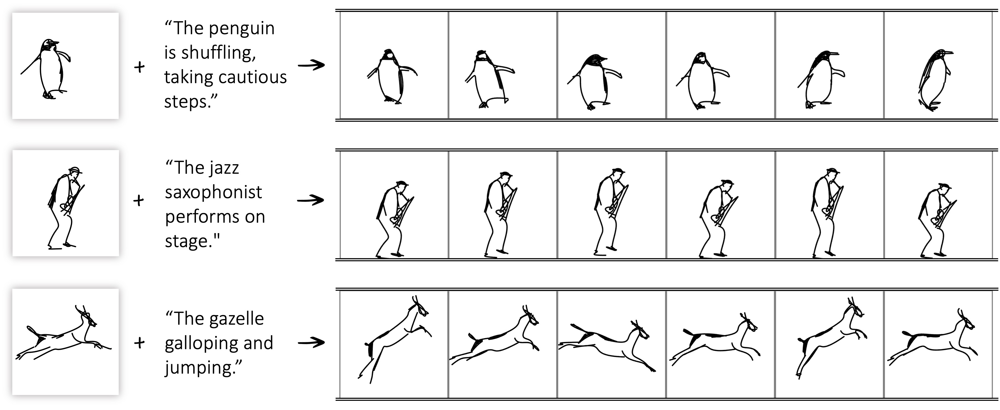

# (Coming Soon)
# Breathing Life Into Sketches Using Text-to-Video Priors

<!-- Official implementation. -->
 

  
  
> <a href="https://livesketch.github.io/">**Breathing Life Into Sketches Using Text-to-Video Priors**</a>
>
> <a href="https://rinongal.github.io/">Rinon Gal</a>,
<a href="https://yael-vinker.github.io/website/">Yael Vinker</a>,
<a href="https://yuval-alaluf.github.io/">Yuval Alaluf</a>,
<a href="https://www.cs.tau.ac.il/~amberman/">Amit Bermano</a>
<a href="https://danielcohenor.com/">Daniel Cohen-Or</a>
<a href="https://faculty.idc.ac.il/arik/site/index.asp">Ariel Shamir</a>
<a href="https://chechiklab.biu.ac.il/~gal/">Gal Chechik</a>
>  
> Given a still sketch in vector format and a text prompt describing a desired action, our method automatically animates the drawing with respect to the prompt.

